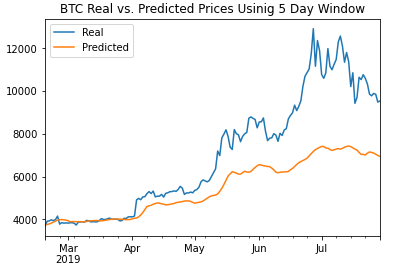
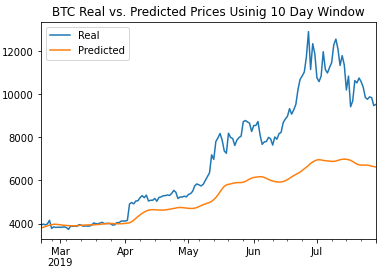

# Deep Learning Homework

## Which model has a lower loss?
### The model using the BTC close prices has a lower loss than the model using the fng values.

## Which model tracks the actual values better over time?
### The model using the BTC close prices more closely tracks the actual values of BTC closing prices than does the fng values model.

##  Which window size works best for the model?
### It looks like a model with a smaller window size (I tested for both 5 day and ten day, see png files below) performs better than the 10 day window size. The models perform better in March to June, but then real vs predicted values  start to diverge pretty dramatically and I think this could be attributed to the parabolic move up in BTC prices in June. The model was trained on only 70% of the real data, and this trained data didn't have as large of moves up in prices. So i think the shorter window size works better for this reason.

### Five Day Window 

### Ten Day Window

